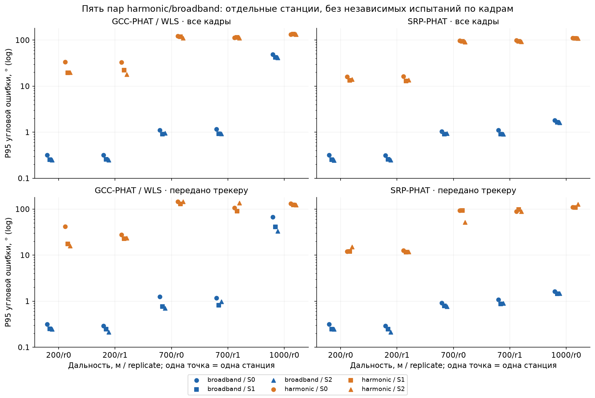
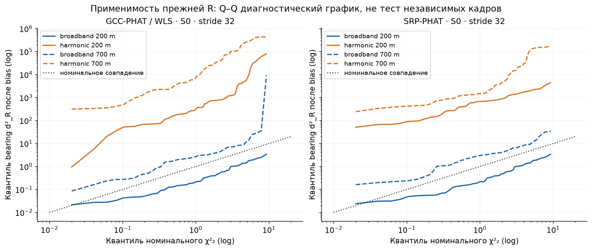
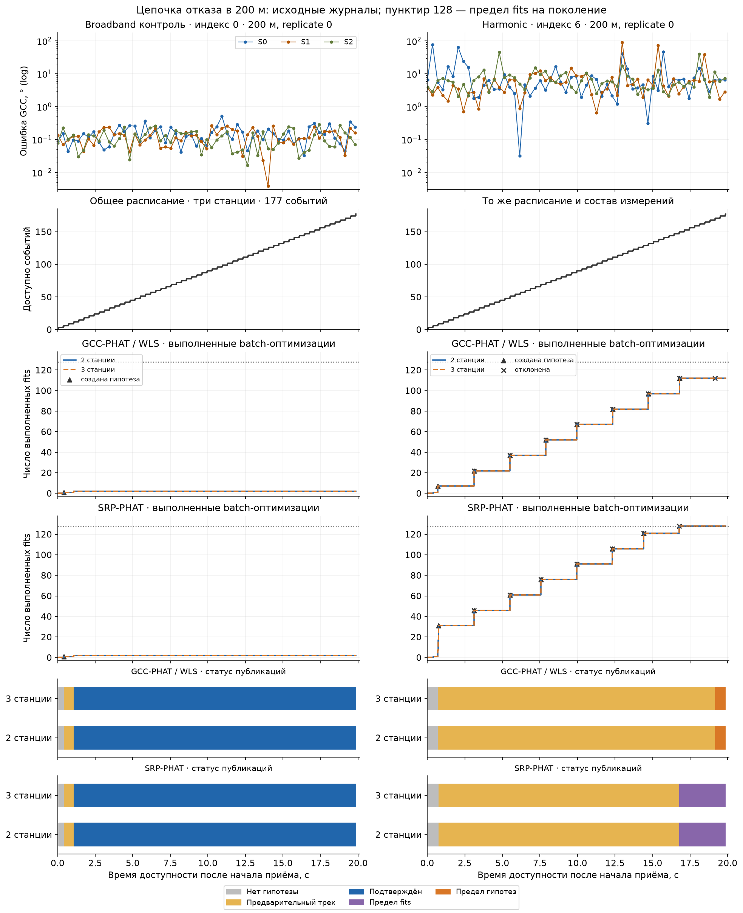

# S8: диагностика отказов harmonic → bearing → calibration → track

Дата: 2026-10-03. База `ae2858718bd00a318512d996589d91ade7c9a578`;
протокол зафиксирован **до расчётов** коммитом `3bbf527`.
Ветка `analysis/harmonic-tracking-failure`. Это диагностика текущего S8;
S8 остаётся **In progress**.

## Что проверено и с какой областью действия

Исследованы ровно пары (0,6), (1,7), (2,8), (3,9), (4,10): пять завершённых
spatial harmonic случаев и пять broadband контролей, оба bearing-метода и
оба правила подтверждения, всего **40 исторических треков**. Прочитаны
112 500 валидных bearing кадров; отдельно посчитаны все кадры и события
с фиксированным `frame_index % 32 == 0`. Исторические данные не пересчитывались.

[Протокол](HARMONIC_TRACKING_FAILURE_PROTOCOL.md) и
[снимок SHA 529 входных файлов](HARMONIC_TRACKING_FAILURE_PROTOCOL_MANIFEST.json)
фиксируют состав, настройки и пределы. [Pair audit](results/harmonic_tracking_failure/pair_audit.json)
подтверждает точное совпадение записи движения, переноса геометрии, базового и
станционных noise seeds, SHA стандартизованного шума, station/frame/method
состава, физических и availability времён. Различаются источники и source seeds.
Event IDs разных источников не пересекаются.

Это описательные сравнения пяти фиксированных пар. Общие физические траектории,
source banks, повторные дальности и noise реализации связывают случаи;
ни кадры, ни эти десять записей не объявлены независимыми полевыми испытаниями.
Исходная матрица остаётся остановленной: **15/24 потоков и 60/96 треков**.
Её остальные девять потоков, полёты, аудиосинтез и Monte Carlo не запускались.

## 1. Насколько harmonic ухудшает направления?

**Установлено: ухудшение возникает уже в bearing frontend.** У всех
исследованных кадров обоих методов сохранено `valid=True`, включая большие
ошибки; доля валидных направлений равна 100% и во всех кадрах, и после stride.
При этом ошибка harmonic намного больше парного broadband контроля.

В таблице — **медиана трёх станционных P95**, не P95 общей смеси и не оценка
доверительного интервала. Для каждой отдельной станции полный набор median,
P95, maximum, долей >5°/>10°/>30° сохранён в
[bearing_metrics.csv.gz](results/harmonic_tracking_failure/bearing_metrics.csv.gz)
(120 строк: 10 случаев × 3 станции × 2 метода × 2 набора кадров).

| Пара broadband/harmonic | Дальность / replicate | GCC P95, °, передано трекеру | SRP P95, °, передано трекеру |
|---|---|---:|---:|
| 0 / 6 | 200 м / 0 | 0,250 → 17,494 | 0,246 → 12,003 |
| 1 / 7 | 200 м / 1 | 0,247 → 23,649 | 0,247 → 11,778 |
| 2 / 8 | 700 м / 0 | 0,761 → 144,566 | 0,784 → 93,285 |
| 3 / 9 | 700 м / 1 | 0,969 → 106,460 | 0,904 → 88,290 |
| 4 / 10 | 1000 м / 0 | 41,293 → 122,941 | 1,462 → 109,106 |



Большие ошибки не объясняются только детерминированным отбором кадров:
первый ряд графика показывает ухудшение и во всех кадрах. Broadband/GCC на
1000 м также имеет тяжёлый хвост, поэтому broadband здесь не идеальный контроль.

Серии крупных ошибок посчитаны отдельно при каждом пороге и наборе кадров:
[large_error_runs.csv.gz](results/harmonic_tracking_failure/large_error_runs.csv.gz).
Exposure серии — число подряд идущих кадров × шаг сетки; невалидность и
пропуски времени разрывают её. После stride шаг 0,341333 с. Максимальная
серия >10° у harmonic составляет **17,408 с GCC / 3,755 с SRP**; у broadband
**1,365 с GCC / 0 с SRP**. Это зависимые серии, не число независимых отказов.

Величина ошибки не демонстрирует универсальную сильную согласованность:
медиана lag-1 корреляции после stride у harmonic **0,017 GCC / 0,023 SRP**,
межстанционной — **0,139 / 0,033**. Для всех кадров lag-1 **0,150 / 0,199**.
Межстанционные коэффициенты отдельных harmonic случаев после stride лежат
в пределах GCC −0,145…0,335 и SRP −0,137…0,223. Корреляции компонент,
другие временные лаги, совпадения >10° и знаменатели сохранены в
[temporal_correlations.csv.gz](results/harmonic_tracking_failure/temporal_correlations.csv.gz)
и [interstation_correlations.csv.gz](results/harmonic_tracking_failure/interstation_correlations.csv.gz).
Корреляция амплитуды не доказывает согласованный общий ложный bearing.

## 2. Соответствует ли ошибкам существующая калибровка?

Остатки восстановлены в том же **prediction tangent basis** и с тем же
знаком bias, что используются историческими `BearingMeasurement` и трекером:

$$
t_{r,k}=t_{e,k}+\frac{\|q(t_{e,k})-p_k\|}{c},\qquad
u_k=Q_k^T\frac{q(t_{e,k})-p_k}{\|q(t_{e,k})-p_k\|},\quad c=343\;\mathrm{m/s},
$$

$$
e_k=B(u_k)\operatorname{Log}_{u_k}(\hat u_k),\qquad
e_{c,k}=e_k-b_k,\qquad d_{R,k}^{2}=e_{c,k}^{T}R_k^{-1}e_{c,k}.
$$

`B` — ортонормированный касательный базис, компоненты в angular-arc radians.
Реконструированные сферические остатки и геодезические углы сверены со всеми
сохранёнными валидными bearing строками; notebook независимо повторяет
вычисление одного исходного события.

**Установлено: прежние bias/R не описывают harmonic остатки как одно малое
локальное гауссовское распределение.** В следующей таблице — медианы
станционно-последовательностных показателей после stride. В каждой строке
200/700 м по 6 таких групп на метод, 1000 м — по 3; они зависимы.

| Дальность | Источник | Median d²_R GCC / SRP | Доля внутри nominal χ²₂ 95%, GCC / SRP |
|---|---|---:|---:|
| 200 м | broadband | 0,265 / 0,251 | 100% / 100% |
| 200 м | harmonic | 507,10 / 667,28 | 1,69% / 0,85% |
| 700 м | broadband | 2,95 / 3,01 | 77,12% / 79,66% |
| 700 м | harmonic | 13 151,33 / 2 213,78 | 0% / 0% |
| 1000 м | broadband | 35,19 / 8,66 | 25,42% / 40,68% |
| 1000 м | harmonic | 25 499,46 / 7 127,32 | 0% / 0% |



Bias имеет норму **0,009–0,029°**. Он не может устранить наблюдаемые ошибки
в несколько/десятки градусов; до и после компенсации их масштаб остаётся
несовместимым с прежней R. Медиана нормы эмпирического среднего harmonic
остатка после bias на 200 м — **1,861° GCC / 1,033° SRP**, на 700 м —
**16,190° / 10,290°**. Проверены также эмпирическая sample covariance,
её спектр в whitened координатах, skewness и excess kurtosis. Сильные хвосты,
смещение и масштаб на Q–Q не соответствуют номинальной центральной χ²₂;
это описательная диагностика, без iid p-value и без заявления о числе мод.

[calibration_metrics.csv.gz](results/harmonic_tracking_failure/calibration_metrics.csv.gz)
хранит до/после bias, mean/covariance и все распределительные показатели;
[bearing_residuals.csv.gz](results/harmonic_tracking_failure/bearing_residuals.csv.gz)
связывает каждую производную величину с исходным event ID.
Эмпирические mean/R **не обучались для работы алгоритма**. Calibration origin
и её SHA `37b7dd77…` остались прежними и evaluation не использовали.

Это **bearing d²_R**, а не innovation NIS. Predictive confirmation и EKF
используют неопределённость состояния:

$$\mathrm{NIS}=\nu^TS^{-1}\nu,\qquad S=HPH^T+R.$$

`preliminary_nis_values` и `final_nis_values` исторических гипотез — batch
fit scores с R; `confirmation_nis_values` — predictive scores с S.
Производная таблица использует явные префиксы `preliminary_R`, `final_R`,
`predictive_S`, чтобы эти показатели не смешивать.

## 3. Как именно происходит отказ инициализации/подтверждения?

[chain_summary.csv.gz](results/harmonic_tracking_failure/chain_summary.csv.gz)
содержит все 40 вариантов, [batch_attempts.csv.gz](results/harmonic_tracking_failure/batch_attempts.csv.gz)
— 3293 записанных попытки с доступными событиями, составом fit и reception span,
[hypothesis_details.csv.gz](results/harmonic_tracking_failure/hypothesis_details.csv.gz)
— 200 решений по гипотезам с раздельными R/S scores,
[fit_generation_counts.csv.gz](results/harmonic_tracking_failure/fit_generation_counts.csv.gz)
— число фактических оптимизаций в каждом поколении и суммарный учёт.
Отклонённые до оптимизации попытки не включены в executed fits.

### Harmonic 200 м, replicate 0 (индекс 6) рядом с broadband 0

Оба потока передали **177 событий / 177 публикационных эпох**, по 59
на каждую станцию, reception span **19,797333 с**. Первое доступное
шести-событийное построение: t=**0,402646 с**, три станции, span **0,341333 с**.
GCC первая попытка не прошла `projected_kkt_not_satisfied`; SRP —
`maximum_angular_residual_above_limit`. Измерения были доступны; потери
транспортного состава не являются объяснением отказа.

| Метод, оба правила подтверждения | Broadband 0 | Harmonic 6 |
|---|---|---|
| GCC | 1 гипотеза, 2 fits, подтверждение 1,055313 с, 168/177 valid | 8 гипотез, 112 fits, 0/177 valid; предел гипотез в 19,160979 с |
| SRP | 1 гипотеза, 2 fits, подтверждение 1,055313 с, 168/177 valid | 7 гипотез, 128 fits + 1 отказ до fit, 0/177 valid; предел fits в 16,771646 с |

**Цепочка GCC:** из 112 fits — 69 `batch_invalid`, 27 превышений max angular
residual, 16 `batch_passed`. Численная допустимость не гарантирует R-consensus:
первая созданная в **0,713979 с** гипотеза имеет **0/7** preliminary R inliers
среди доступных событий (median score **152,93**). Допустимая численная модель
может пройти предел angular residual **0,1 rad**, но не согласоваться с
калиброванной R и следующими измерениями. В **3,118313 с** первая гипотеза
отклонена `confirmation_inconsistent`: predictive S scores принимают только
**2/22** поздних события от **одной станции**; нужно минимум три измерения,
нужное число станций и reception span. Следующие семь гипотез также отвергнуты.
В каждой после первой при отказе остаётся не более одного predictive inlier,
а начиная с третьей — ноль. До final confirmation refit дело не дошло:
все сохранённые fits harmonic 6 относятся к `construction`.

**Цепочка SRP:** 62 `batch_invalid`, 52 превышения max angular residual,
14 `batch_passed`; первая гипотеза создана в **0,743979 с**.
Все семь отклонены `confirmation_inconsistent`; в сохранённых решениях
отклонения — **0/20** predictive inliers. После последнего отклонения
исчерпан 128-fit бюджет. Поэтому бюджет — итог предшествующей неуспешной
цепочки, а не самостоятельное объяснение качества измерений.



### Harmonic 700 м, replicate 0 (индекс 8)

У обоих методов и обоих правил — **0 гипотез / 0 valid**, 128 фактических
оптимизаций и одна отклонённая до fit попытка. GCC: 123 `batch_invalid`
(38 forward-ray, 40 local observability, 36 projected KKT, 9 optimizer
ValueError) + 5 max-angular отказов. SRP: 122 `batch_invalid`
(33 local observability, 85 projected KKT, 4 optimizer ValueError)
+ 6 max-angular отказов. Здесь цепочка обрывается уже на построении.
Индексы 9/10 также не создали допустимых гипотез; оба правила подтверждения
ещё не могут различиться. Подробные причины по всем индексам — в таблицах.

Внешний исторический wall timeout потока **11** — отдельный технический
стоп основной матрицы. Он не является причиной отсутствия трека в этих
пяти **полностью завершённых** harmonic случаях. Предел восьми гипотез,
предел 128 fits на поколение и внешний 1800-секундный дедлайн учитываются
раздельно. Среди выбранных 40 треков есть 42 поколения: после reset нельзя
заменять сумму по всем поколениям счётчиком последнего.

### Четыре идеальных replay

Исторические журналы не показывали, способен ли неизменный тракт пройти
инициализацию на тех же расписании/геометрии при идеальном направлении.
Выполнены только четыре заранее выбранных replay, последовательно,
**14,753 с суммарно**, максимальное отдельное время **4,350 с**;
лимиты 1800 с/replay и 7200 с суммарно соблюдены.

Имя входа: `ideal_bearing_zero_bias_same_R`. Направления заново рассчитаны
из записанной траектории при фактическом reception time и индивидуальном
retarded emission time станции, сверены с сохранённой evaluator truth.
ID, availability, validity, состав и R сохранены; bias=0. Истинные координаты
и скорость инициализатору/фильтру не передавались.

| Случай | Метод | Valid /177 | Подтверждение, с | Ошибка первого подтверждения, м | Условная RMSE, м | Fits |
|---|---|---:|---:|---:|---:|---:|
| 6 / 200 м | GCC | 168 | 1,055313 | 0,103 | 1,440 | 2 |
| 6 / 200 м | SRP | 168 | 1,055313 | 0,103 | 1,438 | 2 |
| 8 / 700 м | GCC | 168 | 1,055313 | 0,633 | 7,232 | 2 |
| 8 / 700 м | SRP | 168 | 1,055313 | 0,633 | 7,231 | 2 |

[Ledger](results/harmonic_tracking_failure/ideal_replays/replay_ledger.json)
фиксирует все четыре реально запущенных процесса; в отдельных каталогах
сохранены input, шесть журналов, candidate diagnostics, incremental
checkpoints, summary и внешний supervision. Условная RMSE считается только
по valid epochs и не означает полевой точности или устранения ошибок манёвра.

**Установлено:** неизменная цепочка проходит подтверждение на идеальном входе
в выбранных двух случаях. **Граница вывода:** replay одновременно убирает
ошибку направления и bias compensation и сам по себе их не разделяет.
Сравнение размеров остатков отдельно показывает, что малый bias не объясняет
наблюдаемую многоградусную bearing ошибку. Влияние малого bias на плохо
обусловленную координатную оценку не объявлено полностью исключённым.

## 4. Одно следующее изменение

**Предлагается проверить explicit ambiguity/validity gate bearing frontend**
по наблюдаемой структуре сигнала/оценивания, чтобы сомнительные направления
не передавались как обычные валидные Gaussian bearings. Это предложение,
а не уже найденный рабочий порог и не обещание улучшить tracking availability.
Основание: все исследованные bearing кадры valid, хотя harmonic ошибки
несопоставимы с R, а на идеальном входе та же инициализация подтверждается.
Изменение только R или computational budget не устраняет установленное
рассогласование входа; их настройка на этой evaluation запрещена.

Сначала отдельные development source/noise seeds и сохранение наблюдаемых
candidate scores/lag curves, затем замороженный gate и **новые независимые
source sessions/записи движения и noise seeds** для evaluation. Если доступны
только синтетические сигналы, явно ограничить вывод спектральным benchmark,
не считать фрагменты одного source bank независимыми записями. Парно
сравнивать unchanged/gated frontend на одном аудио при прежних R/tracker,
показывая bearing valid fraction, angular tails и confirmed availability
с полными знаменателями. Пороги не выбирать на индексах 0–10 этой работы.

**Гипотеза, пока не доказанная:** крупные ошибки связаны с неоднозначностью
пеленгования гармонического сигнала. Исторические correlation curves и
выбранные pair-lag peaks не сохранены, поэтому приписать отказы именно
ложным корреляционным пикам нельзя. Также не экспортированы все geometric
candidate rejections, состояния/ковариации гипотез и каждое промежуточное
решение подтверждения. Полные counts geometric candidates и точная
внутренняя причина каждого невыполненного refit по этим журналам невозможны.

## Исправления контроля выполнения

`analysis/study_execution.py` и `analysis/unseen_execution_v2.py` вводят
**execution version 2**. Обычные `run-one`, `smoke`, `run-all` при наличии
исторического или нового `technical_stop.json` отказываются **до загрузки и
вычислений**. Продолжение требует отдельного frozen authorization с SHA
stop/evaluation/protocol и явным scope индексов; разрешение на основную
матрицу этой работой не создаётся.

Внешний parent ограничивает wall time процесса, убивает и reap worker при
дедлайне; worker также имеет watchdog. Новые outputs/completion/supervision
хранятся в `execution_v2`, старые partial/complete manifests не переписываются.
Каждый вариант считается завершённым лишь после проверки всех **шести**
журналов, их схем и SHA, полного exact publication schedule, принадлежности
событий и происхождения bearing/settings. Completion marker сохраняется
атомарно. При разрешённом продолжении проверенные completion пропускаются;
исторические partial variants можно импортировать только по SHA исходного
partial audit, полному комплекту и расписанию. Один CSV, header stub или
обрезанное расписание завершением не считаются. Пустой журнал updates допустим
при соответствующем отсутствии обновлений и корректной схеме.

Исторический runner сохранён побайтно в
`analysis/frozen/unseen_manoeuvres_and_sources_v1.py`; его SHA по-прежнему
сверяется с опубликованным manifest. Новый runner имеет собственную версию и
SHA; проверка исходного processing code не отключена. Исторические run IDs,
manifest SHA и численные результаты сохранены. Новая версия запуска испытана
только короткими искусственными процессами и fixtures; основная матрица не
продолжалась.

Новая execution-v2 метка тайм-аута имеет приоритет над исторической: прежнее
authorization не может скрыть новую остановку. Fixture дважды проходит все
четыре завершённых варианта: сначала импортирует проверяемые completions,
затем использует их без аудио и без tracker replay. Отдельная итоговая
агрегация будущего продолжения не выполнялась: прежний `aggregate` требует
полную историческую матрицу и не смешивает с ней новые sidecars.

## Воспроизведение без новых тяжёлых вычислений

Из `uav_acoustic_model` диагностического worktree:

```bash
.venv/bin/python -m analysis.harmonic_tracking_failure verify
.venv/bin/python -m pytest tests/test_harmonic_tracking_failure.py tests/test_unseen_saved_outputs.py tests/test_unseen_manoeuvres_and_sources.py tests/test_unseen_protocol.py -q
.venv/bin/python -m jupyter nbconvert --execute --to notebook --inplace notebooks/harmonic_tracking_failure.ipynb
.venv/bin/python -m pip check
```

Для новой read-only сборки таблиц используйте **новый** каталог:

```bash
.venv/bin/python -m analysis.harmonic_tracking_failure analyze --output results/harmonic_tracking_failure_readonly_copy
```

Эта команда не вызывает audio/frontend/tracker. Notebook читает уже сохранённые
четыре replay, самостоятельно проверяет SHA и заново строит графики; новые
replay при его выполнении не запускаются. Команда `run-selected` отказывается
использовать существующий каталог; принятые четыре replay повторять не нужно.

[Выполненный notebook](notebooks/harmonic_tracking_failure.ipynb): 8/8 code cells.
Графики просмотрены; сохранены исправленные легенда и общие шкалы.
Локальная приёмка: целевые тесты **31 passed**, полный pytest **597 passed**,
`pip check` без конфликтов, `git diff --check` чист. Исходные SHA проверены
повторно после подготовки отчёта; рабочая математика/settings не менялись.
Результаты проверок и фактический CI указаны в актуальном `PROJECT_STATUS.md`
и сообщении при передаче SHA. S8 этой диагностикой не объявляется завершённым.
